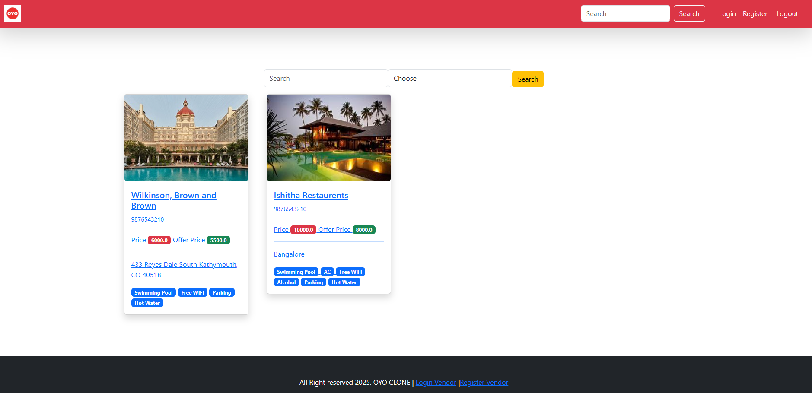
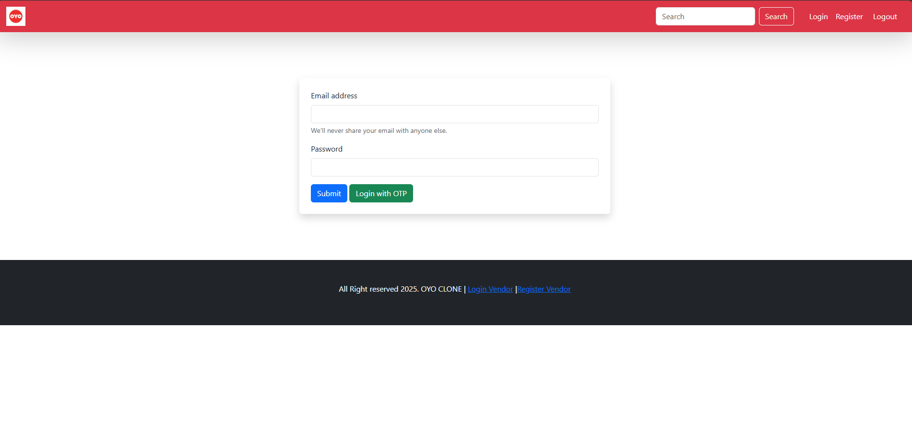
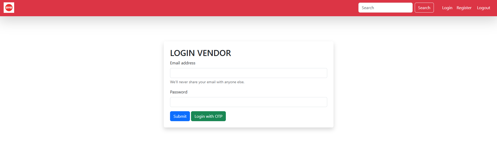
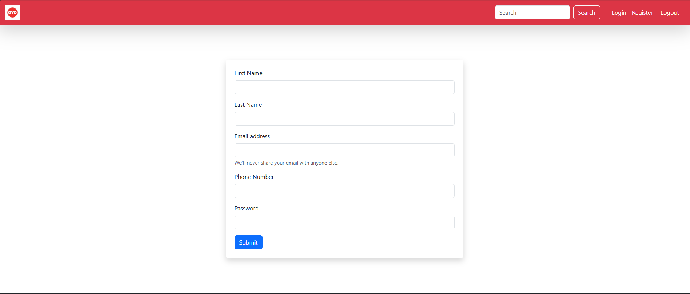
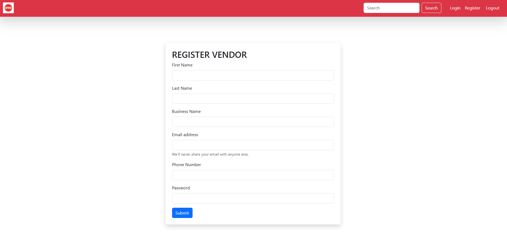
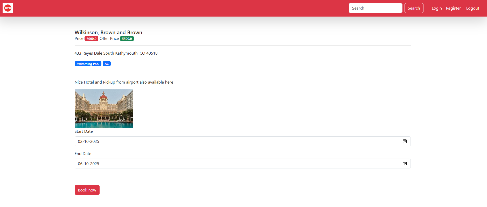
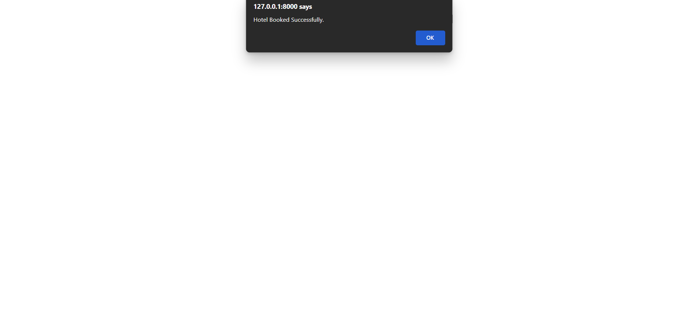

# StayWise 🏨
A Django-based hotel booking application inspired by OYO. StayWise provides a seamless platform for users to browse, book, and manage hotels, while vendors can list properties, update amenities, and manage bookings from a dedicated dashboard.

---

## 🚀 Features
- **User Authentication** (Registration, Login, Email Verification, OTP Login)
- **Vendor Dashboard** (Add/Edit Hotels, Upload Images, Manage Bookings)
- **Hotel Listings** (Search, Sort, and View Hotel Details)
- **Amenities Management** (Add/Remove Amenities for Hotels)
- **Image Management** (Upload/Delete Hotel Images)
- **Slug-based Hotel URLs** for SEO-friendly navigation

---

## 🛠️ Tech Stack
- **Backend:** Django 4.x
- **Frontend:** HTML, CSS, Bootstrap
- **Database:** MariaDB/MySQL
- **Authentication:** Django’s built-in authentication system

---

## 📂 Project Setup
```bash
# 1️⃣ Clone the Repository
git clone https://github.com/<your-username>/staywise.git
cd staywise

# 2️⃣ Create Virtual Environment
python -m venv venv
source venv/bin/activate   # On Mac/Linux
venv\Scripts\activate      # On Windows

# 3️⃣ Install Dependencies
pip install -r requirements.txt

# 4️⃣ Migrate Database
python manage.py makemigrations
python manage.py migrate

# 5️⃣ Create Superuser (Admin Panel)
python manage.py createsuperuser

# 6️⃣ Run Server
python manage.py runserver


---

## 📸 Screenshots

| Home Page | Login Page (User) | Login Page (Vendor) |
|-----------|-------------------|---------------------|
|  |  |  |

| Register Page (User) | Register Page (Vendor) | Booking Page |
|----------------------|------------------------|--------------|
|  |  |  |

| Booking Success |
|-----------------|
|  |

